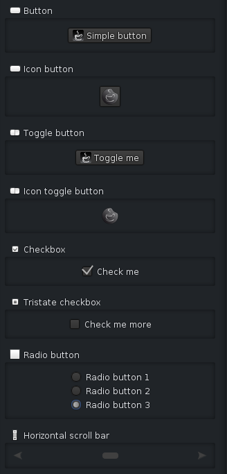

# Submin

## statement

Submin is a pair of skins (one dark, one light) based on the Web Look-and-FeeL for the Swing toolkit.
It is (C)opyright 2012&ndash;2016 by Hanns Holger Rutz. All rights reserved. Submin is released under 
the [GNU General Public License](http://github.com/Sciss/Submin/blob/master/licenses/Submin-License.txt) v3+ 
and comes with  absolutely no warranties. To contact the author, send an email to `contact at sciss.de`.

Please note that Web-LaF is made available both under GNU GPL and a commercial license. However, this
is a derivative project licensed under GNU GPL. If you own a commercial license for Web-LaF, this does
not expand to Submin which is an independently maintained library. If you cannot license your work that
links to Submin under a GPL and own a commercial Web-LaF license, you may get in touch to discuss opportunities
of obtaining a commercial license for Submin as well.

## linking

The following artifact will be available from Maven Central:

    "de.sciss" % "submin" % v

The current version `v` is `"0.2.3"`.

## using

The look-and-feel class name is `de.sciss.submin.SubminLookAndFeel`, which
provides a name `"Submin"` and an id `"submin"`.

Installing this look-and-feel is as simple as the following one line call:

    import de.sciss.submin.Submin
    
    Submin.install(true)  // dark-skin

The boolean argument is `true` for the dark skin and `false` for the light skin.

## building

Submin builds with sbt 0.13. It is written in Java and should run on a Java 6 runtime.

## running

Run a demo with

    sbt "test:run --dark"

## extensions

Except for the customised look, this library provides the following changes

- `FileChooserUI`: under Linux/Gnome we populate the file tree with the Gnome
  favourites as per `~/.config/gtk-3.0/bookmarks`. To support other window managers
  and other operating systems, we require your help. If you can provide information
  on how to obtain favourites e.g. under KDE, on OS X, or Windows, please let me know.

## to-do

- file-chooser: should not expand the user home tree under Gnome
- slider: looks bad in dark skin
- progress-bar: lacks specific indeterminate state painter
- scroll-pane: corner should not be white under dark skin
- tabbed-pane: border decoration looks bad in dark skin. work-around: use `styleId` `"attached"`.

## contributing

Please see the file [CONTRIBUTING.md](CONTRIBUTING.md)
